# [Lakshmipriya Solai - Test Automation Quality Engineer](https://priyasanna.github.io/priyasolai/)

> Building reliable software through rigorous testing and automation

[](https://priyasanna.github.io/priyasolai/)
[](https://linkedin.com/in/lakshmipriya-solai-49bb7250)
[](https://github.com/priyasanna/priyasol.github.io/stargazers)
[](https://github.com/priyasanna/priyasol.github.io/commits/main)


## AI Research Notebooks

### Research Map

**15 Research Notebooks Organized in 3 Categories:**

🟢 **Practical Applications** - Databricks Testing, AutoTriage Assessment, Healthcare AI Agents, CI/CD Optimization, RAG Testing, MCP Testing  
🔵 **Academic Research** - I QA Workforce Transformation, AutoTriage Research, Multi-Agent Orchestration, Monte Carlo Testing, Model Evaluation, LLM Testing  
🟡 **Frameworks & Tools** - Agentic Testing, Automated Patterns, AI Safety

```mermaid
graph TB
    Research[AI Testing Research Portfolio]
    
    Research --> Practical[Practical Applications]
    Research --> Academic[Academic Research]
    Research --> Tools[Frameworks & Tools]
    
    Practical --> Databricks[Databricks Testing<br/>64% Time Reduction]
    Practical --> AutoTriage[AutoTriage Assessment<br/>3.2x ROI]
    Practical --> Healthcare[Healthcare AI Agents<br/>487% ROI]
    Practical --> CICD[CI/CD Optimization<br/>40% Time Saved]
    Practical --> RAG[RAG Testing<br/>Applications]
    Practical --> MCP[MCP in Testing<br/>Context-Aware]
    
    Academic --> IQA[I QA Transformation<br/>Workforce Forecasting]
    Academic --> AutoTriageResearch[AutoTriage Research<br/>85% Accuracy]
    Academic --> MultiAgent[Multi-Agent Orchestration<br/>80.2% Detection]
    Academic --> MonteCarlo[Monte Carlo Testing<br/>POFOD Estimation]
    Academic --> Evaluation[Model Evaluation<br/>GPT-4 vs Claude]
    Academic --> LLMTest[LLM Testing<br/>Methodologies]
    
    Tools --> Agentic[Agentic Testing<br/>Integration]
    Tools --> Patterns[Automated Testing<br/>Patterns]
    Tools --> Safety[AI Safety<br/>Metrics]
    
    style Databricks fill:#51cf66,stroke:#2f9e44,color:#000
    style AutoTriage fill:#51cf66,stroke:#2f9e44,color:#000
    style Healthcare fill:#51cf66,stroke:#2f9e44,color:#000
    style CICD fill:#51cf66,stroke:#2f9e44,color:#000
    style IQA fill:#74c0fc,stroke:#1971c2,color:#000
    style AutoTriageResearch fill:#74c0fc,stroke:#1971c2,color:#000
    style MultiAgent fill:#51cf66,stroke:#2f9e44,color:#000
    style MonteCarlo fill:#74c0fc,stroke:#1971c2,color:#000
    style Evaluation fill:#74c0fc,stroke:#1971c2,color:#000
```



### Quick Reference Table

| Research Paper | Type | Key Results | Primary Focus | Tech Stack |
|----------------|------|-------------|---------------|------------|
| [I, QA: Workforce Transformation](./research/notebooks/llm-qa-workforce-transformation.html) | Academic | 70-85% automation by 2028 | QA profession forecasting | Bass Diffusion, Monte Carlo |
| [Databricks Testing Framework](./research/notebooks/databricks-testing-framework.html) | Practical | 64% time ↓, $1.2M savings | Unified testing platform | Databricks, Delta Lake, MLflow |
| [Healthcare AI Agents](./research/notebooks/ai-agents-qa-healthcare.html) | Case Study | 487% ROI, 92% coverage | Why use AI agents? | LangChain, Playwright |
| [AutoTriage Research Paper](./research/notebooks/autotriage-research-paper.html) | Academic | 85% accuracy, 3.2x ROI | Test automation triage | Ensemble AI Framework |
| [AutoTriage Assessment Tool](./research/notebooks/autotriage-manual-test-assessment.html) | Tool | 4-tier prioritization | Manual test assessment | Business Value Analysis |
| [CI/CD Test Optimization](./research/notebooks/ci-test-optimization-monte-carlo.html) | Tool | 40% time reduction | Optimize pipeline | Monte Carlo, Python |
| [Multi-Agent Orchestration](./research/notebooks/multi-agent-orchestration-framework.html) | Academic | 80.2% detection, 31% cost ↓ | Optimal architecture | ATAO Framework |
| [Monte Carlo Testing](./research/notebooks/monte-carlo-testing-framework.html) | Research | POFOD estimation | Statistical testing | Monte Carlo, scipy |
| [Model Evaluation](./research/notebooks/model-evaluation-software-testing.html) | Framework | GPT-4 vs Claude vs Gemini | Which AI model? | Python, pandas |
| [Agentic Testing](./research/notebooks/agentic-testing-integration.html) | Integration | Multi-agent systems | Implementation guide | AutoGPT, LangChain |
| [MCP Testing](./research/notebooks/mcp-software-testing.html) | Framework | Context-aware testing | Dynamic adaptation | MCP Protocol |
| [RAG Testing](./research/notebooks/rag-testing-applications.html) | Applications | Test generation from docs | Knowledge retrieval | RAG, Vector DBs |
| [LLM Methodologies](./research/notebooks/llm-testing-analysis.html) | Analysis | Hallucination detection | Testing LLMs | Safety frameworks |
| [AI Safety Metrics](./research/notebooks/ai-safety-metrics.html) | Metrics | Prompt injection detection | Security validation | Safety evaluators |
| [Testing Patterns](./research/notebooks/automated-testing-patterns.html) | Patterns | AI-augmented automation | Best practices | Pytest, CI/CD |

### Featured Research

<details>
<summary><b>CI/CD Test Optimization Tool</b> (Production-Ready)</summary>

**Impact:** 40% time reduction • 80% risk coverage  
**Focus:** Ingests test history, runs 10,000 Monte Carlo simulations, outputs optimized suite  
**Exports:** JSON, pytest, GitHub Actions  
`CI-CD` `monte-carlo` `test-optimization` `DevOps`  
**[View](./research/notebooks/ci-test-optimization-monte-carlo.html)** | **[Download](./research/notebooks/ci-test-optimization-monte-carlo.ipynb)**
</details>

<details>
<summary><b>Healthcare AI Agents Case Study</b> (Practical)</summary>

**Impact:** 487% ROI • 92% coverage • 88% faster tests  
**Focus:** Why QA pros use AI agents - 7 agent types with HIPAA compliance  
`AI-agents` `healthcare-QA` `HIPAA-compliance` `autonomous-testing`  
**[View](./research/notebooks/ai-agents-qa-healthcare.html)** | **[Download](./research/notebooks/ai-agents-qa-healthcare.ipynb)**
</details>

<details>
<summary><b>Multi-Agent Orchestration Framework</b> (Academic)</summary>

**Impact:** 80.2% detection • 31% cost reduction • ANOVA validated  
**Focus:** 4 architectures, 50 trials, statistical validation  
`multi-agent-systems` `test-orchestration` `manager-worker`  
**[View](./research/notebooks/multi-agent-orchestration-framework.html)** | **[Download](./research/notebooks/multi-agent-orchestration-framework.ipynb)**
</details>

<details>
<summary><b>Monte Carlo Testing Framework</b> (Research)</summary>

**Impact:** POFOD estimation • Statistical reliability assessment  
**Focus:** Risk-based testing, fuzzing, chaos engineering  
`monte-carlo` `statistical-testing` `POFOD`  
**[View](./research/notebooks/monte-carlo-testing-framework.html)** | **[Download](./research/notebooks/monte-carlo-testing-framework.ipynb)**
</details>

<details>
<summary><b>AI Model Evaluation Framework</b> (Comparative)</summary>

**Impact:** Comprehensive model comparison  
**Focus:** GPT-4 • Claude 3.5 • Gemini Pro • CodeLlama  
`AI-model-evaluation` `LLM-benchmarking` `GPT-4`  
**[View](./research/notebooks/model-evaluation-software-testing.html)** | **[Download](./research/notebooks/model-evaluation-software-testing.ipynb)**
</details>

**[View All 15 Research Notebooks →](./research/)** | **[Complete Research Index](./research/notebooks/README.md)**

---

## Featured Projects

### LLMGuardian - Production AI Testing Framework
*Advanced validation for Large Language Models with RAG, MCP, and safety testing*

**Impact:** 23% accuracy improvement • 60% faster testing • 3 critical safety violations prevented  
**Tech:** JavaScript/Node.js, AI APIs, RAG, MCP  
`LLM-testing` `AI-safety` `RAG` `MCP` `production-AI`  
**[Live Demo](./llm-guardian/demo.html)** | **[Documentation](./llm-guardian/)** | **[Case Studies](./llm-guardian/case-studies/)**

### Legacy-AI Bridge Framework  
*Gradual AI integration for enterprise systems without disruption*

**Impact:** 40% faster processing • 60% fraud reduction • Zero downtime migration  
**Tech:** Python, Legacy System Integration, AI/ML Pipeline  
**[Framework Details](./legacy-ai-bridge/)** | **[Assessment Tool](./legacy-ai-bridge/assessment-template.md)**

### Job Search Automation Suite
*Ethical AI-powered automation for career management*

**Impact:** 60% time reduction • 85% job matching accuracy • Improved application quality  
**Tech:** Python, Playwright, AI/ML, React/TypeScript  
**[Quick Start](./job-search-automation/quick-start.html)** | **[Try Dashboard](./job-search-automation/app.html)** | **[Documentation](./job-search-automation/)**

### AI IDE Collection - Gotta Code 'Em All
*Interactive comparison of 10 AI-powered development environments*

**Analysis:** 100+ hours testing • S-Tier through B-Tier rankings • Real-world performance insights  
**IDEs:** Cursor, Windsurf, Void, Continue.dev, GitHub Copilot, Zed, Replit AI, CodeWhisperer, Tabnine  
`developer-tools` `AI-assistants` `IDE-comparison` `code-editors`  
**[View Comparison](./ai-ide-comparison/)** | **[Source Code](https://github.com/priyasanna/priyasol.github.io/tree/main/ai-ide-comparison)**

### Algorithmic Trading System
*Systematic quantitative trading with risk management*

**Performance:** +127% total return • 1.67 Sharpe ratio • 64% win rate  
**Tech:** Python, pandas, Statistical Analysis, Risk Management  
**[Strategy Details](./algorithmic-trading/)** | **[Implementation](./algorithmic-trading/strategy-implementation.md)**

[**View All Projects →**](./PROJECTS.md)

## Fun

### AI vs Human: Code Detective Challenge
*Test your skills at distinguishing AI-generated code from human-written code*

Can you spot the difference between code written by AI and code written by humans? This interactive game presents real code snippets and challenges you to identify their origin. Learn the subtle patterns that distinguish AI coding style from human creativity and problem-solving approaches.

**Features:**
- 6 diverse code examples from simple functions to complex implementations
- Real-time scoring and accuracy tracking
- Educational explanations for each code snippet
- Mobile-responsive futuristic design
- No registration required - jump right in!

**[Play the Game →](https://priyasanna.github.io/priyasolai/#fun-zone)**

*Challenge yourself: Can you achieve 80%+ accuracy and earn the "AI Code Detective" title?*

## Recognition

### GitHub Metrics


### Impact Metrics
- **Test Frameworks Built**: Multiple production-ready test automation frameworks
- **Test Coverage Improvement**: Significant coverage increases across projects  
- **Automation Efficiency**: Reduced manual testing time by 60-80% on average
- **CI/CD Integration**: Successfully integrated test automation into multiple CI/CD pipelines

## Star History
[](https://star-history.com/#priyasanna/priyasol.github.io&Date)

## Contributing

Found this useful? Here's how you can help:
- **Star the repo** to show support
- **Report issues** you encounter  
- **Suggest improvements** via [issues](https://github.com/priyasanna/priyasol.github.io/issues)
- **Share** with your network

### Community Engagement
- **[Issues](https://github.com/priyasanna/priyasol.github.io/issues)**: Join the conversation about test automation and QA best practices
- **[Issues](https://github.com/priyasanna/priyasol.github.io/issues)**: Report bugs or request features
- **[Contributors](https://github.com/priyasanna/priyasol.github.io/graphs/contributors)**: See who's helping build this project

## Learning Resources

### Test Automation Resources
- **[QA Prompt Library](./qa-prompts/)** - Curated prompts for test generation, API testing, and mobile testing
- **[Test Automation Patterns](./research/papers/automated-testing-patterns.md)** - Best practices and patterns for test automation
- **[CI/CD Test Optimization](./research/notebooks/ci-test-optimization-monte-carlo.html)** - Optimize your test suites for CI/CD pipelines

### Portfolio Customization
**Want to customize this template for your QA portfolio?** See: **[Customization Guide](./docs/CUSTOMIZATION.md)**

## Architecture

### Repository Structure
```
├── llm-guardian/                 # LLM Testing Framework (Flagship Project)
│   ├── README.md                 # Framework documentation
│   ├── demo.html                 # Interactive demonstrations
│   ├── index.html                # Main entry point
│   ├── src/                      # Core framework code
│   │   ├── evaluators/           # Testing evaluators
│   │   ├── llm-tester.js         # Main testing interface
│   │   ├── rag-evaluator.js      # RAG system evaluation
│   │   ├── safety-evaluator.js   # Safety validation
│   │   └── mcp-server.js         # MCP integration
│   ├── examples/                 # Usage examples
│   │   └── demo.js               # Demo implementations
│   ├── case-studies/             # Real-world implementations
│   │   ├── README.md
│   │   ├── financial-services-chatbot.md
│   │   └── ecommerce-recommendations.md
│   └── reasoning-examples/       # Extended thinking examples
│       └── test-planning-reasoning.md
├── legacy-ai-bridge/             # Enterprise AI integration framework
│   ├── README.md                 # Framework overview
│   └── assessment-template.md    # Legacy system evaluation
├── job-search-automation/        # AI automation project
│   ├── README.md                 # Project documentation
│   ├── quick-start.html          # Interactive setup guide
│   ├── app.html                  # Production dashboard
│   ├── backend/                  # FastAPI backend
│   │   ├── main.py               # API server
│   │   ├── job_scraper.py        # Job board integration
│   │   ├── resume_parser.py      # Resume parsing
│   │   └── job_matcher.py        # AI matching engine
│   └── ethical-automation-guide.md
├── ai-ide-comparison/            # AI IDE comparison project
│   ├── index.html                # Interactive comparison tool
│   └── README.md                 # Project documentation
├── algorithmic-trading/          # Quantitative trading project
│   ├── README.md                 # Strategy overview and results
│   └── strategy-implementation.md # Technical implementation
├── qa-prompts/                   # AI prompt library for QA/SDET
│   ├── README.md                 # Library overview
│   ├── prompts/                  # Categorized prompt collections
│   │   ├── test-generation.md
│   │   ├── api-testing.md
│   │   ├── code-generation.md
│   │   └── mobile-testing.md
│   └── examples/
│       └── sample-outputs.md
├── research/                     # AI Research & Jupyter Notebooks
│   ├── index.html                # Research landing page
│   ├── notebooks/                # Jupyter notebook collection
│   │   ├── README.md             # Complete notebook index with tags
│   │   ├── ai-agents-qa-healthcare.ipynb       # Healthcare AI agents case study
│   │   ├── ai-agents-qa-healthcare.html        # HTML viewer
│   │   ├── model-evaluation-software-testing.ipynb # AI model evaluation framework
│   │   ├── model-evaluation-software-testing.html  # HTML viewer
│   │   ├── agentic-testing-integration.ipynb   # Agentic testing research
│   │   ├── agentic-testing-integration.html    # HTML viewer
│   │   ├── mcp-software-testing.ipynb          # MCP applications
│   │   ├── mcp-software-testing.html           # HTML viewer
│   │   ├── rag-testing-applications.ipynb      # RAG for testing
│   │   ├── rag-testing-applications.html       # HTML viewer
│   │   ├── llm-testing-analysis.ipynb          # LLM testing methodologies
│   │   ├── llm-testing-analysis.html           # HTML viewer
│   │   ├── ai-safety-metrics.ipynb             # AI safety metrics
│   │   ├── ai-safety-metrics.html              # HTML viewer
│   │   ├── automated-testing-patterns.ipynb    # Testing patterns
│   │   └── automated-testing-patterns.html     # HTML viewer
│   └── papers/                   # Research papers
│       ├── automated-testing-patterns.md
│       └── automated-testing-patterns.html
├── docs/                         # Learning resources and guides
│   ├── PROMPT-ENGINEERING-GUIDE.md
│   ├── AI-WORKFLOW-INTEGRATION.md
│   ├── AI-FIRST-MANIFESTO.md
│   ├── AI-FIRST-PRINCIPLES.md
│   ├── AI-ADOPTION-ROADMAP.md
│   ├── START-HERE.md
│   ├── CUSTOMIZATION.md
│   ├── ARCHITECTURE.md
│   ├── FEATURES.md
│   ├── DEVELOPMENT-TIMELINE.md
│   └── SEO-AND-DISCOVERABILITY-GUIDE.md
├── learn/                        # Interactive learning hub
│   ├── index.html                # Learning portal
│   └── README.md
├── screenshots/                  # Project screenshots
│   └── README.md
├── .github/                      # GitHub configuration
│   └── workflows/                # CI/CD pipelines
├── images/                       # Assets and media
│   ├── profile.jpg
│   ├── ela-mcb-metallic.jpg
│   ├── favicon.svg
│   └── site.webmanifest
├── index.html                    # Main portfolio page
├── analytics.html                # Analytics dashboard
├── ANALYTICS-README.md           # Analytics documentation
├── PROJECTS.md                   # Complete project list
├── CONTRIBUTING.md               # Contribution guidelines
├── LICENSE                       # MIT License
└── README.md                     # This file
```

### Professional Focus

**Test Automation & Quality Assurance Expertise:**

- **Automated Testing Frameworks**: Building robust, maintainable test automation frameworks using Playwright, Selenium, and Python
- **API Testing**: Comprehensive API testing with Postman, Rest Assured, and custom automation scripts
- **CI/CD Integration**: Implementing test automation in CI/CD pipelines for continuous quality assurance
- **Test Strategy & Planning**: Designing comprehensive test strategies, test plans, and risk-based testing approaches
- **Quality Metrics & Reporting**: Tracking test coverage, defect metrics, and quality KPIs

### Core Competencies
- **Test Automation**: Playwright, Selenium WebDriver, Cypress, TestNG, JUnit, Pytest
- **API Testing**: REST API testing, SOAP, GraphQL validation
- **Programming**: Python, Java, JavaScript/TypeScript, Shell scripting
- **Tools**: Postman, Jenkins, GitLab CI, GitHub Actions, Jira, TestRail
- **Database Testing**: SQL queries, database validation, data integrity testing
- **Mobile Testing**: Mobile web and app testing strategies

**Perfect for**: Teams seeking experienced QA engineers who can build scalable test automation frameworks and ensure software quality at every stage of development.

## Repository Activity
[](https://github.com/priyasanna/priyasol.github.io/graphs/commit-activity)

## License

MIT License - feel free to use this template for your own portfolio!

```bibtex
@portfolio{priyasol2025,
    address = {USA},
    author = {Lakshmipriya Solai},
    title = {{Test Automation Quality Engineering Portfolio}},
    url = {https://priyasanna.github.io/priyasolai/},
    linkedin = {https://linkedin.com/in/lakshmipriya-solai-49bb7250},
    github = {https://github.com/priyasanna},
    year = {2025}
}
```

---